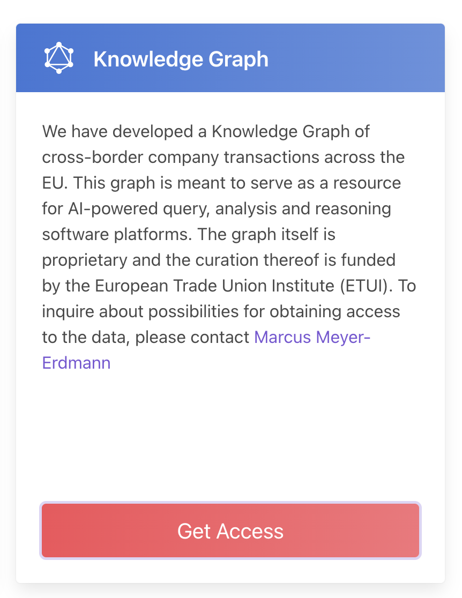
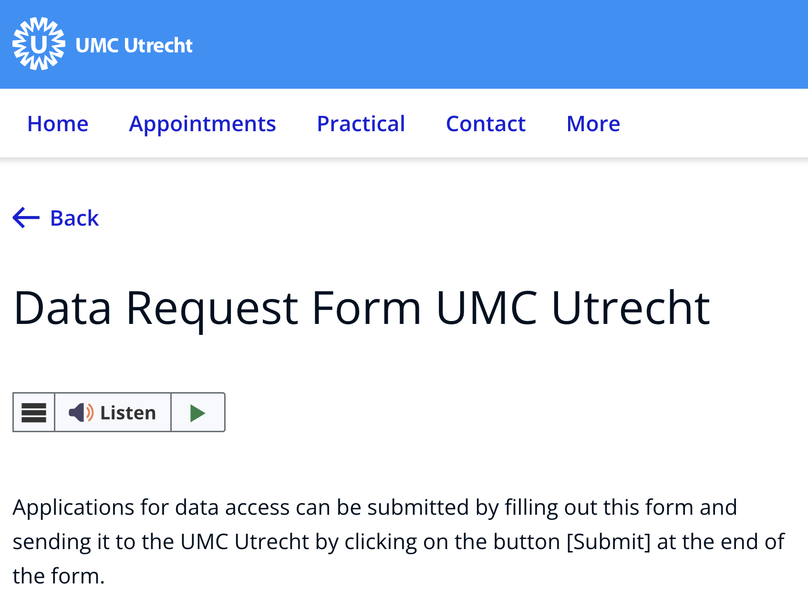
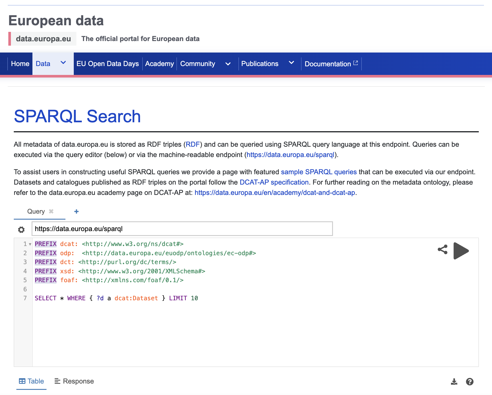

:::::::::::::::::::::::::::::::::::::: questions

- What are data access protocols?
- Is open access a data access protocol?
- Can data be exposed as a service through FAIR API protocols?

::::::::::::::::::::::::::::::::::::::::::::::::

::::::::::::::::::::::::::::::::::::: objectives

- Learn what data access protocols are.
- Distinguish between human-facing and machine-facing access instructions.
- Explore how FAIR API protocols can expose data as a service.

::::::::::::::::::::::::::::::::::::::::::::::::

::::::::::::::::::::::::::::::::::::: callout

### FAIR principles used in data access protocols

Accessible:

- FM-A1.1 Access Protocol: <https://doi.org/10.25504/FAIRsharing.yDJci5>
- FM-A1.2 Access Authorization: <https://doi.org/10.25504/FAIRsharing.EwnE1n>

Interoperable:

- FM-I3 Use Qualified References: <https://doi.org/10.25504/FAIRsharing.B2sbNh>

::::::::::::::::::::::::::::::::::::::::::::::::

## What are data access protocols?

Data access protocols are the explicit rules and steps that tell humans or
machines how to access a data source.

{alt='Electronic access control system with keypad'}

Just as you need the correct key, code, or procedure to enter a secure room,
data access often depends on following the correct process.

| Access protocol | Example | Note |
| --- | --- | --- |
| Communication between machines | HTTP request or API call | A machine requests information using a standard network protocol |
| Communication between humans | Data request form or email workflow | A person follows explicit instructions to request access |

{alt='Example of a human-oriented access workflow'}
{alt='Screenshot of a human-facing data request form'}

::::::::::::::::::::::::::::::::::::: callout

### Protocols are rules communicated in a shared language

Humans may use a written access policy or form, while machines use APIs and
network protocols such as HTTP. Common API styles include SOAP, REST, and
SPARQL.

::::::::::::::::::::::::::::::::::::::::::::::::

## Is open access a data access protocol?

Strictly speaking, open access is a policy framework rather than a network
protocol, but in practice it functions as an access model with explicit rules:
the data can be retrieved openly without individual authorization.

Depositing data in a public repository often gives the resource an open-access
access route automatically. Some open datasets also expose machine-readable
access through APIs or SPARQL endpoints.

Example:

- EU public data SPARQL interface:
  <https://data.europa.eu/data/sparql>
- Endpoint:
  <https://data.europa.eu/sparql>

{alt='Screenshot of a SPARQL endpoint example'}

::::::::::::::::::::::::::::::::::::: challenge

## Exercise

Visit the Zenodo COVID-19 community:

<https://zenodo.org/communities/covid-19/>

What is the default data access protocol visible for the displayed records?

:::::::::::::::::::::::: solution

The records are presented as open access resources, which is visible through the
repository interface and download behavior.

:::::::::::::::::::::::::

::::::::::::::::::::::::::::::::::::::::::::::::

::::::::::::::::::::::::::::::::::::: callout

### Open access can be human-friendly and machine-friendly

Humans see direct download options. Machines see stable web requests and, in
some systems, structured service endpoints.

::::::::::::::::::::::::::::::::::::::::::::::::

## Can data be exposed as a service through FAIR API protocols?

Yes, but it requires technical infrastructure and some familiarity with linked
data or knowledge graph tooling.

Useful tools include:

| Tool | Source | GUI | Note |
| --- | --- | --- | --- |
| TriplyDB | <https://triplydb.com/> | Yes | Quick hosted option for exposing data |
| GraphDB | <https://www.ontotext.com/products/graphdb/> | Yes | Requires a server or managed deployment |
| FAIR Data Point | <https://github.com/fair-data/fairdatapoint> | No | Powerful but technical |
| rdflib-endpoint | <https://pypi.org/project/rdflib-endpoint/> | No | Fast local route for experimentation |

::::::::::::::::::::::::::::::::::::: callout

### Register FAIR APIs where others can find them

If you expose a FAIR API or similar service endpoint, register it in an
appropriate service registry such as SMART API:

<https://www.smart-api.info/>

::::::::::::::::::::::::::::::::::::::::::::::::

::::::::::::::::::::::::::::::::::::: challenge

## Exercise

Expose RDF data through a service endpoint:

1. Reuse the RDF data generated from the data descriptions episode, or bring
   another RDF file.
2. Install `rdflib-endpoint`.
3. Run a local service and confirm that the data can be queried.

:::::::::::::::::::::::: solution

This is intentionally optional. The goal is to understand what it takes to move
from static downloadable data to a service-oriented access model.

:::::::::::::::::::::::::

::::::::::::::::::::::::::::::::::::::::::::::::

::::::::::::::::::::::::::::::::::::: discussion

### Scenario

You have sensitive financial information that cannot be openly disclosed, but
you still want to enable legitimate research access.

What kind of human and machine access protocols would you design? What should be
openly visible, and what should only be available behind review or controlled
authorization?

::::::::::::::::::::::::::::::::::::::::::::::::

::::::::::::::::::::::::::::::::::::: keypoints

- Data access protocols describe how humans and machines gain access to data.
- Open access is an access model that can still be expressed through explicit
  rules and interfaces.
- Human-facing request forms and machine-facing APIs are both important access
  patterns in FAIR data practice.
- FAIR service endpoints are more useful when they are registered and
  discoverable.

::::::::::::::::::::::::::::::::::::::::::::::::
