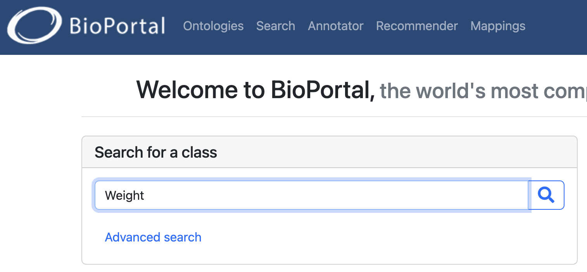
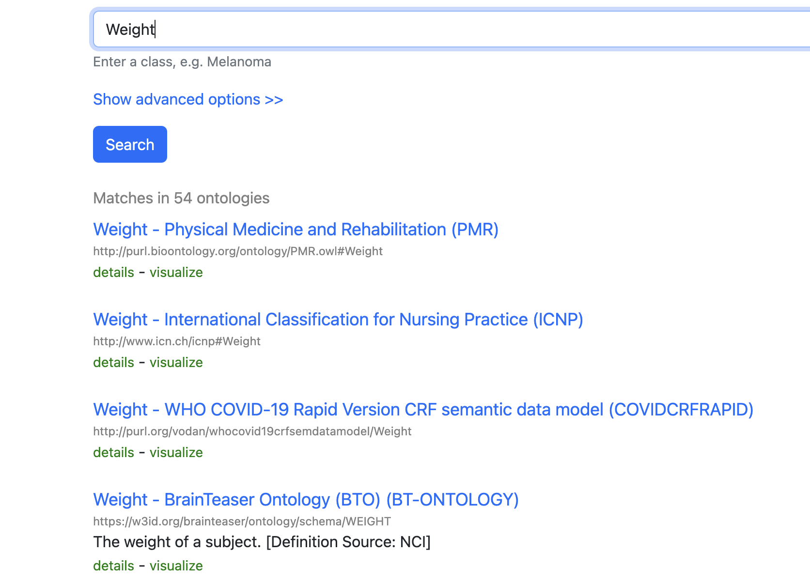
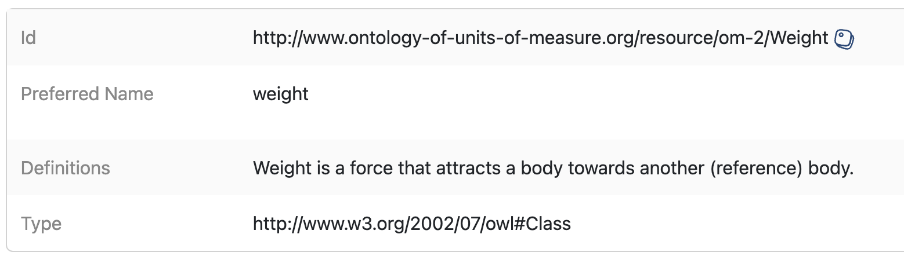

:::::::::::::::::::::::::::::::::::::: questions

- What are data descriptions?
- How can data descriptions be reused?
- Are there standard ways to create them?
- What is the relationship between data descriptions and linked data?

::::::::::::::::::::::::::::::::::::::::::::::::

::::::::::::::::::::::::::::::::::::: objectives

- Recognize that different communities use different names for data
  descriptions.
- Learn how to build machine-friendly data description files.
- Understand why reusing ontology terms improves interoperability.

::::::::::::::::::::::::::::::::::::::::::::::::

::::::::::::::::::::::::::::::::::::: callout

### FAIR principles used in data descriptions

Interoperable:

- FM-I1 Use a Knowledge Representation Language:
  <https://doi.org/10.25504/FAIRsharing.jLpL6i>
- FM-I2 Use FAIR Vocabularies:
  <https://doi.org/10.25504/FAIRsharing.0A9kNV>

Reusable:

- FM-R1.3 Meets Community Standards:
  <https://doi.org/10.25504/FAIRsharing.cuyPH9>

::::::::::::::::::::::::::::::::::::::::::::::::

## What are data descriptions?

Data descriptions document the meaning of each data attribute or variable in a
dataset.

Depending on the discipline, similar documents may be called:

- codebooks
- data dictionaries
- labels or data tags
- data glossaries

Example:

| Variable name | Description | Scale |
| --- | --- | --- |
| Weight | Weight of a human | kilograms |
| Height | Height of a human | centimetres |
| Age | Age of a human | years |
| Blood glucose level | Blood glucose level of a human | mg/dl |

::::::::::::::::::::::::::::::::::::: callout

### Different fields use different names

No matter what the document is called, the goal is the same: describe what the
 dataset variables mean so others can interpret and reuse the data correctly.

::::::::::::::::::::::::::::::::::::::::::::::::

## How can data descriptions be reused?

Writing documentation takes time, so when possible you should reuse accepted
community definitions instead of inventing a new description every time.

BioPortal is a good example of a registry where community-maintained ontology
terms can be searched and reused:

- BioPortal: <https://bioportal.bioontology.org/>

{alt='BioPortal search results interface'}
{alt='Different ontology matches for the same concept'}
{alt='Ontology entry with persistent identifier'}

::::::::::::::::::::::::::::::::::::: callout

### Reuse ontology terms when possible

Advantages:

- you do not need to redefine common concepts repeatedly
- you gain a persistent identifier for the concept
- other systems can align variables across datasets more easily

Disadvantages:

- sometimes no existing ontology fits the exact concept you need

::::::::::::::::::::::::::::::::::::::::::::::::

## Are there standard ways to create data descriptions?

There is no single universal format, but the minimum useful description usually
includes:

- the variable name
- a definition
- ideally, a link to the reused ontology term or community definition

Some general-purpose vocabularies and metadata schemas include:

| Resource | Link | Use |
| --- | --- | --- |
| Schema.org | <https://schema.org/> | Generic web concepts |
| DBpedia | <https://www.dbpedia.org/resources/lookup/> | Concepts derived from Wikipedia |
| DCAT | <https://www.w3.org/TR/vocab-dcat-2/> | Data catalog concepts |
| Dublin Core | <https://www.dublincore.org/specifications/dublin-core/dcmi-terms/> | General metadata terms |

Public registries that help locate vocabularies include:

- Linked Open Vocabularies: <https://lov.linkeddata.es/dataset/lov/>
- EU Vocabularies: <https://op.europa.eu/en/web/eu-vocabularies>
- BioPortal: <https://bioportal.bioontology.org/>
- AgroPortal: <http://agroportal.lirmm.fr/>
- EcoPortal: <http://ecoportal.lifewatchitaly.eu/>
- Ontology Lookup Service: <https://www.ebi.ac.uk/ols/index>
- Bioschemas: <https://bioschemas.org/>

::::::::::::::::::::::::::::::::::::: challenge

## Exercise

Visit BioPortal and search for a term describing `blood glucose level`.

What ontology term would you reuse, and what persistent identifier does it
provide?

:::::::::::::::::::::::: solution

There is more than one possible match, but a valid answer is to identify a term
such as the clinical measurement concept and record its ontology URI or other
persistent identifier provided by the registry.

:::::::::::::::::::::::::

::::::::::::::::::::::::::::::::::::::::::::::::

Data descriptions are often maintained as tables in `.csv`, `.xlsx`, or similar
formats. For databases, it is also useful to provide both a machine-readable
schema and a human-readable diagram.

{alt='Illustration comparing data and data dictionary concepts'}

Other human-friendly approaches include dataset nutrition labels and automated
codebook tools, but the FAIR principles push further toward structured,
machine-actionable formats.

## What is the relationship between data descriptions and linked data?

When data descriptions reuse ontology terms and stable identifiers, datasets can
be transformed into linked data formats such as RDF and become easier to
combine with other resources.

Tools that can help with this include:

| Tool | Source | GUI | Note |
| --- | --- | --- | --- |
| OpenRefine | <https://openrefine.org/> | Yes | Flexible but can be heavy to install |
| RMLMapper | <https://github.com/RMLio/rmlmapper-java/releases> | No | Powerful, but technical |
| SDM-RDFizer | <https://github.com/SDM-TIB/SDM-RDFizer> | No | Requires programming familiarity |
| SPARQL-Generate | <https://ci.mines-stetienne.fr/sparql-generate/> | Yes | Good if you want to learn SPARQL |
| Virtuoso Universal Server | <https://virtuoso.openlinksw.com/> | Yes | Commercial licensing may apply |
| UM LDWizard | <https://github.com/MaastrichtU-IDS/ldwizard-humanities> | Yes | Quick route to publishable linked data |

::::::::::::::::::::::::::::::::::::: challenge

## Exercise

Transform a dataset from XLSX to RDF using UM LDWizard:

1. Download the mock dataset: [MOCK DATA](data/MOCK_DATA_BOOTCAMP.xlsx)
2. Convert the dataset into RDF
3. Record which ontology terms you reused for the variables

:::::::::::::::::::::::: solution

There is no single correct answer. The important part is to reuse existing
ontology terms where possible and document the choices you made.

:::::::::::::::::::::::::

::::::::::::::::::::::::::::::::::::::::::::::::

::::::::::::::::::::::::::::::::::::: discussion

### Scenario

Your marine biology group has discovered new organisms, but you cannot find an
existing ontology that fits the concepts you need.

What should you do? Should you adapt an existing vocabulary, create local terms,
or work with the community toward a new ontology extension?

::::::::::::::::::::::::::::::::::::::::::::::::

::::::::::::::::::::::::::::::::::::: keypoints

- Data descriptions may appear under names such as codebook or data dictionary.
- Reusing ontology terms reduces ambiguity and improves interoperability.
- A useful description links dataset variables to accepted community concepts.
- Linked data becomes more feasible when descriptions are structured and
  identifier-based.

::::::::::::::::::::::::::::::::::::::::::::::::
