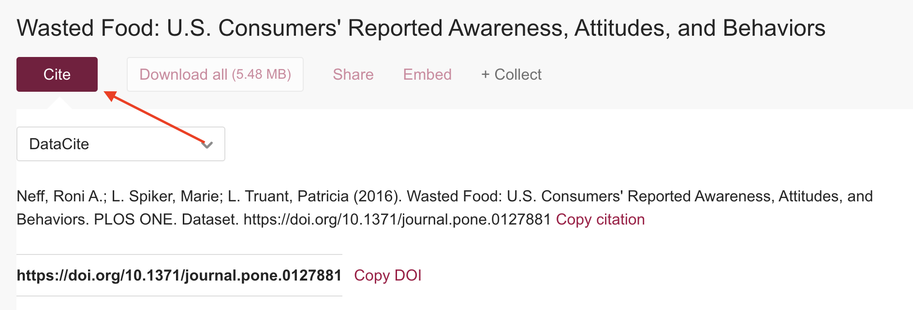
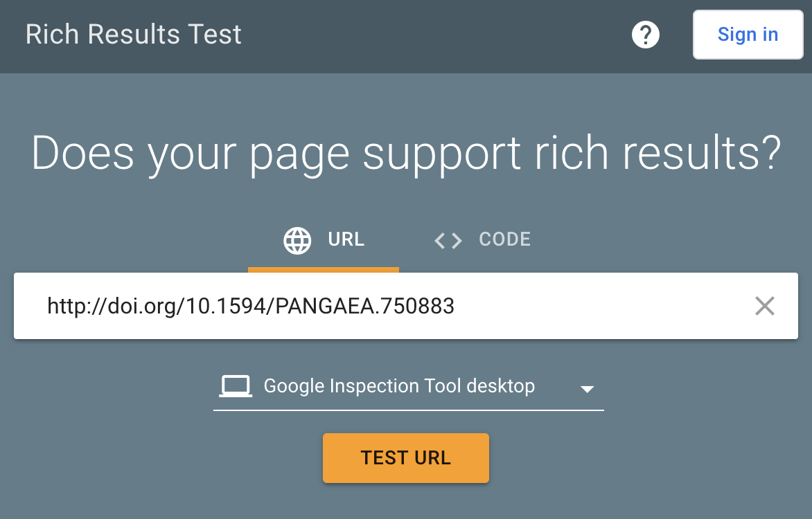
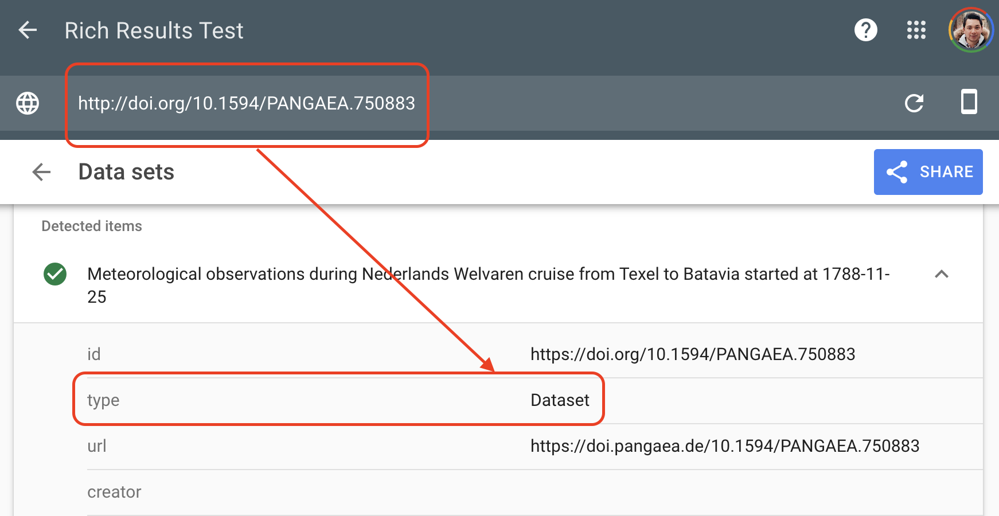

:::::::::::::::::::::::::::::::::::::: questions

- How should data be cited when reusing a data source?
- How can you check whether data is likely to be reused and discovered?

::::::::::::::::::::::::::::::::::::::::::::::::

::::::::::::::::::::::::::::::::::::: objectives

- Understand the importance of citing datasets.
- Learn how discoverability testing supports future data reuse.
- Connect reuse to rich metadata and structured web data.

::::::::::::::::::::::::::::::::::::::::::::::::

::::::::::::::::::::::::::::::::::::: callout

### FAIR principles used in data reuse

Findable:

- FM-F1B Identifier persistence: <https://doi.org/10.25504/FAIRsharing.TUq8Zj>
- FM-F4 Indexed in a Searchable Resource:
  <https://doi.org/10.25504/FAIRsharing.Lcws1N>

Reusable:

- FM-R1.2 Detailed Provenance: <https://doi.org/10.25504/FAIRsharing.qcziIV>

::::::::::::::::::::::::::::::::::::::::::::::::

## How should data be cited when reusing a data source?

Data reuse means working with an existing research data source rather than
generating all material from scratch.

At minimum, a dataset citation should include:

- creator
- publication year
- title
- resource type or version
- publisher
- persistent identifier, usually DOI

Example citation:

> Neff, Roni A.; L. Spiker, Marie; L. Truant, Patricia (2016). Wasted Food:
> U.S. Consumers' Reported Awareness, Attitudes, and Behaviors. PLOS ONE.
> Dataset. <https://doi.org/10.1371/journal.pone.0127881>

Original dataset example:

- <https://figshare.com/articles/dataset/_Wasted_Food_U_S_Consumers_Reported_Awareness_Attitudes_and_Behaviors_/1445199>

{alt='Dataset repository page with citation tools'}

::::::::::::::::::::::::::::::::::::: callout

### Standard citations improve discoverability

When datasets are cited in recognizable formats, citation indexes and data
aggregators can track those references much more effectively.

::::::::::::::::::::::::::::::::::::::::::::::::

## How can you check whether data is likely to be reused and discovered?

Datasets are digital objects on the web. To be reused, they must first be easy
to find. That depends heavily on rich metadata and structured web markup.

Google's Rich Results Test is one way to inspect whether a dataset page exposes
structured information machines can recognize:

- <https://search.google.com/test/rich-results>

Example test:

- <https://search.google.com/test/rich-results?url=http%3A%2F%2Fdoi.org%2F10.1594%2FPANGAEA.750883>

{alt='Entering a dataset URL in Google Rich Results Test'}
{alt='Test results after checking a dataset URL'}

::::::::::::::::::::::::::::::::::::: callout

### Without rich metadata, data can be effectively invisible

A dataset may be accessible to humans through a webpage and still remain hard
for search engines or data aggregators to interpret.

::::::::::::::::::::::::::::::::::::::::::::::::

::::::::::::::::::::::::::::::::::::: challenge

## Exercise

Visit the Culture Crime News database:

<https://news.culturecrime.org/all>

Run Google's Rich Results Test on that resource.

Did the test detect a structured dataset?

:::::::::::::::::::::::: solution

No. This is a useful reminder that a human-friendly page is not automatically a
machine-friendly dataset description.

:::::::::::::::::::::::::

::::::::::::::::::::::::::::::::::::::::::::::::

If you want to go further, review Google's explanation of the Rich Results Test:

- <https://support.google.com/webmasters/answer/7445569>

Search engines and data aggregators rely on shared standards such as:

- Schema.org dataset markup: <https://schema.org/Dataset>
- DCAT: <https://www.w3.org/TR/vocab-dcat/>
- Semantic Web concepts more broadly:
  <https://en.wikipedia.org/wiki/Semantic_Web>

An example of dataset-oriented JSON-LD:

```json
{
  "@context": "https://schema.org/",
  "@type": "Dataset",
  "name": "Dummy Data",
  "description": "This is an example for the coursebook",
  "url": "https://example.com",
  "identifier": ["https://doi.org/XXXXXX"],
  "license": "https://creativecommons.org/publicdomain/zero/1.0/",
  "isAccessibleForFree": true
}
```

::::::::::::::::::::::::::::::::::::: challenge

## Exercise

Go back to the dataset you uploaded in the data archiving episode and export its
rich metadata as JSON-LD.

What similarities do you notice between that export and the example above?

:::::::::::::::::::::::: solution

You should usually see:

- JSON-LD as the format
- Schema.org or another shared schema as the vocabulary context
- `Dataset` or an equivalent type
- explicit fields for identifier, title, description, and license

:::::::::::::::::::::::::

::::::::::::::::::::::::::::::::::::::::::::::::

::::::::::::::::::::::::::::::::::::: discussion

### Discussion

Pick one or more datasets used in this lesson and test them with a FAIR
assessment tool such as FAIR enough:

<https://fair-enough.semanticscience.org/>

What do the scores suggest about reuse readiness, and which missing metadata or
links would most improve them?

::::::::::::::::::::::::::::::::::::::::::::::::

::::::::::::::::::::::::::::::::::::: keypoints

- Reuse starts with clear citation and persistent identifiers.
- Rich metadata is essential for search engines and aggregators to discover
  datasets.
- Human-friendly web pages are not enough; machine-readable structure matters.
- Testing discoverability is a practical part of making data reusable.

::::::::::::::::::::::::::::::::::::::::::::::::
