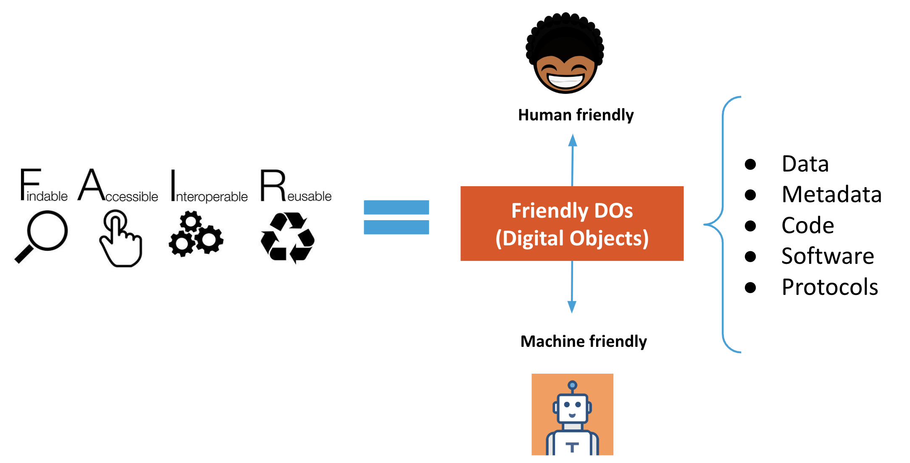

:::::::::::::::::::::::::::::::::::::: questions

- Does FAIR data mean open data?
- What are digital objects and persistent identifiers?
- What kinds of persistent identifiers are commonly used?

::::::::::::::::::::::::::::::::::::::::::::::::

::::::::::::::::::::::::::::::::::::: objectives

- Understand that FAIR does not simply mean open.
- Explain the difference between human-readable and machine-friendly digital
  objects.
- Recognize DOI as one type of PID used to identify digital objects.

::::::::::::::::::::::::::::::::::::::::::::::::

## Does FAIR data mean open data?

::::::::::::::::::::::::::::::::::::: callout

### FAIR is not identical to open

FAIR means that data and related research objects are designed to be easy for
humans and machines to find, understand, access, and reuse. Some FAIR data can
also be open, but openness and FAIRness are not the same thing.

::::::::::::::::::::::::::::::::::::::::::::::::

{alt='Diagram connecting FAIR and Open Science concepts'}

::::::::::::::::::::::::::::::::::::: discussion

### Human-readable vs machine-friendly

Human-readable content is easy for a person to inspect directly, but that does
not guarantee that software can parse and reuse it automatically. Machine
readable content uses explicit structure, such as CSV, JSON, or XML, so a
computer can interpret relationships and values without guessing.

During this lesson, "machine-friendly" is used broadly to mean material that is
machine-readable and also supports further automated action and interoperability.

::::::::::::::::::::::::::::::::::::::::::::::::

{alt='Illustration about machine-friendly digital objects'}

## What are digital objects and persistent identifiers?

A digital object is a sequence of bits stored in digital memory that has
informational value on its own. Examples include:

- a scientific publication
- a dataset
- a rich metadata record
- a README file describing access and reuse conditions

A persistent identifier, or PID, is a durable reference to a digital or
physical resource. PIDs are backed by technical infrastructure and governance
arrangements that help them continue resolving even when the resource itself
changes location.

Common uses of PIDs include identifying:

- articles, datasets, and software
- researchers
- organizations and funders
- projects and instruments
- physical samples and media objects

DOI is one well-known PID type and is commonly used for datasets and
publications. ORCID is another example, focused on researcher identity.

For a short explainer, see the
[FREYA project video on the importance of PIDs](https://en.wikipedia.org/wiki/File:FREYA-The-power-of-PIDs-V05-1.webm).

::::::::::::::::::::::::::::::::::::: challenge

## Exercise

Visit the
[recent machine learning submissions on arXiv](https://arxiv.org/list/cs.LG/recent).

Pick a paper, open its PDF, and search for `http` or `doi`.

What kinds of links do the authors use for data or software references, and why
is a DOI usually more robust than a personal website or repository link alone?

:::::::::::::::::::::::: solution

Authors often link to GitHub repositories, project pages, or other web pages
for software and data. Those locations may move or disappear over time. A DOI
is more robust because it resolves through persistent infrastructure and points
to current metadata about the object even if the storage location changes.

:::::::::::::::::::::::::

::::::::::::::::::::::::::::::::::::::::::::::::

::::::::::::::::::::::::::::::::::::: discussion

### Reflection

How does your discipline usually share data? Is there a data journal, domain
repository, or another community-specific mechanism for making research outputs
findable and reusable?

::::::::::::::::::::::::::::::::::::::::::::::::

::::::::::::::::::::::::::::::::::::: keypoints

- FAIR means making research objects more usable by humans and machines, not
  automatically making them open.
- Machine-friendly objects are structured so software can interpret and reuse
  them reliably.
- Digital objects include datasets, publications, metadata records, and related
  documentation.
- DOI is a common PID used for datasets and publications.

::::::::::::::::::::::::::::::::::::::::::::::::
