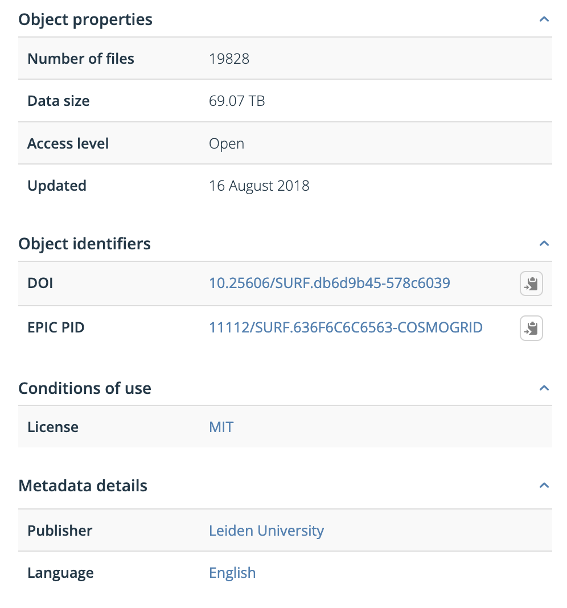
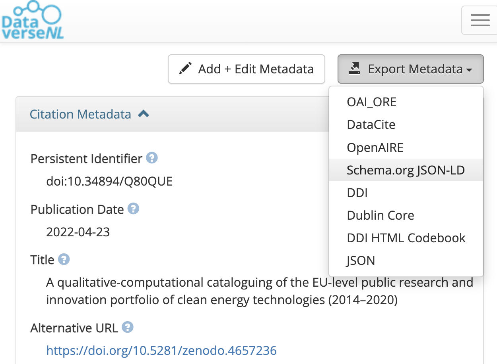

:::::::::::::::::::::::::::::::::::::: questions

- What is the difference between metadata and rich metadata?
- How can a rich metadata file be created?
- Where should rich metadata be stored?

::::::::::::::::::::::::::::::::::::::::::::::::

::::::::::::::::::::::::::::::::::::: objectives

- Understand the difference between plain metadata and rich metadata.
- Learn where machine-readable metadata comes from and how to generate it.
- Identify good places to publish rich metadata files.

::::::::::::::::::::::::::::::::::::::::::::::::

::::::::::::::::::::::::::::::::::::: callout

### FAIR principles used for rich metadata

Findable:

- FM-F2 Machine-readability of Metadata:
  <https://doi.org/10.25504/FAIRsharing.ztr3n9>

Interoperable:

- FM-I1 Use a Knowledge Representation Language:
  <https://doi.org/10.25504/FAIRsharing.jLpL6i>
- FM-I2 Use FAIR Vocabularies:
  <https://doi.org/10.25504/FAIRsharing.0A9kNV>

::::::::::::::::::::::::::::::::::::::::::::::::

## What is the difference between metadata and rich metadata?

Metadata is data about the data. It describes properties of a digital object,
such as title, creator, publisher, size, or identifier.

{alt='Example of metadata fields shown in a repository'}

| Metadata attribute | Example |
| --- | --- |
| Descriptive metadata | DOI |
| Structural metadata | Data size |
| Administrative metadata | Publisher |
| Statistical metadata | Number of files |

Rich metadata goes further. It is:

- standardized
- structured
- machine-readable
- based on shared vocabularies
- suitable for search engines and automated reuse

::::::::::::::::::::::::::::::::::::: callout

### Rich metadata is more than plain text

Metadata alone can be descriptive but still hard for machines to interpret.
Rich metadata uses a structured format such as JSON-LD and shared schemas such
as Schema.org, DataCite, or Dublin Core.

::::::::::::::::::::::::::::::::::::::::::::::::

Further reading:

- The Turing Way on metadata:
  <https://the-turing-way.netlify.app/reproducible-research/rdm/rdm-metadata.html>
- CESSDA training on documenting data:
  <https://www.youtube.com/watch?v=cjGz-I0GgKk>
- Google dataset structured data guidance:
  <https://developers.google.com/search/docs/advanced/structured-data/dataset>

Additional walkthrough:

- Zenodo metadata video: <https://www.youtube.com/embed/S1qK_TA52e4>

## How can a rich metadata file be created?

Researchers usually do not need to write rich metadata by hand. In many cases,
it can be exported from a repository or generated through a form-based tool.

| Platform | Source | Online | Note |
| --- | --- | --- | --- |
| Dataverse export button | <https://dataverse.nl/dataset.xhtml?persistentId=doi:10.34894/Q80QUE> | Yes | Fastest path for datasets |
| FAIR Metadata Wizard | <https://maastrichtu-ids.github.io/fair-metadata-wizard/> | Yes | Tailored to scientific projects |
| NSDRA JSON-LD generator | <https://nsdra.github.io/nsdra-jsonld-metadata-generator-webapp/#> | Yes | Community-specific but adaptable |
| Steal Our JSON-LD | <https://jsonld.com/json-ld-generator/> | Yes | General-purpose |
| JSON-LD Schema Generator for SEO | <https://hallanalysis.com/json-ld-generator/> | Yes | Broad but SEO-oriented |

{alt='Repository export interface showing JSON-LD options'}

## Where should a rich metadata file be stored?

A simple rule is:

::::::::::::::::::::::::::::::::::::: callout

### Publish rich metadata everywhere the data lives

- in the project root folder
- in the data repository
- in the GitHub repository
- on the project website

::::::::::::::::::::::::::::::::::::::::::::::::

The exact schema may differ by context, but common choices include:

- DataCite Metadata Schema: <https://schema.datacite.org>
- Dublin Core: <https://www.dublincore.org>
- discipline-specific schemas such as DDI or Darwin Core

Rich metadata also helps connect publications, datasets, and project websites.
Without structured metadata, search engines and aggregators may not recognize
the resource as a dataset at all.

::::::::::::::::::::::::::::::::::::: discussion

### Scenario

You are creating a project website for a research consortium.

How should rich metadata relate to that website? Which information belongs in
the HTML, which belongs in repository records, and how do those pieces work
together to improve discovery?

::::::::::::::::::::::::::::::::::::::::::::::::

::::::::::::::::::::::::::::::::::::: keypoints

- Rich metadata combines descriptive metadata with shared vocabularies and a
  structured machine-readable format.
- JSON-LD is a common way to publish rich metadata.
- Repositories can often generate rich metadata automatically.
- Rich metadata should be published anywhere the digital object is stored or
  represented.

::::::::::::::::::::::::::::::::::::::::::::::::
