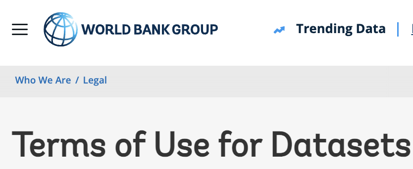
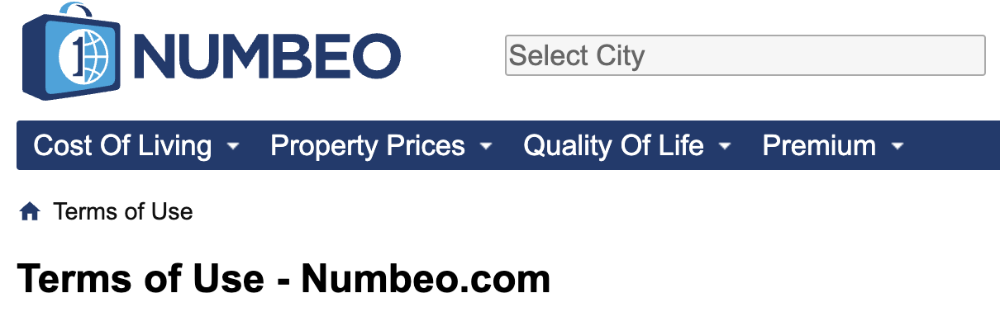

:::::::::::::::::::::::::::::::::::::: questions

- What are data terms of use?
- What should a data terms of use statement contain?
- What format should terms of use use?
- What standard licenses are available for data?

::::::::::::::::::::::::::::::::::::::::::::::::

::::::::::::::::::::::::::::::::::::: objectives

- Understand what data terms of use are and why they matter.
- Identify the minimum components of a basic terms of use statement.
- Recognize when a standard license is sufficient and when a custom agreement is
  needed.

::::::::::::::::::::::::::::::::::::::::::::::::

::::::::::::::::::::::::::::::::::::: callout

### FAIR principles used in data terms of use

Accessible:

- FM-A2 Metadata Longevity: [https://doi.org/10.25504/FAIRsharing.A2W4nz](https://doi.org/10.25504/FAIRsharing.A2W4nz)

Reusable:

- FM-R1.1 Accessible Usage License: [https://doi.org/10.25504/FAIRsharing.fsB7NK](https://doi.org/10.25504/FAIRsharing.fsB7NK)

::::::::::::::::::::::::::::::::::::::::::::::::

## What are data terms of use?

Data terms of use are a textual statement that sets out the rules, conditions,
licenses, and legal considerations that govern reuse of a data source.

{alt='Screenshot of a data terms of use page'}

Examples:

- World Bank terms of use for datasets:
  [https://www.worldbank.org/en/about/legal/terms-of-use-for-datasets](https://www.worldbank.org/en/about/legal/terms-of-use-for-datasets)
- Numbeo terms of use:
  [https://www.numbeo.com/common/terms_of_use.jsp](https://www.numbeo.com/common/terms_of_use.jsp)

{alt='Screenshot of another terms of use page'}

These examples show that terms of use usually describe the resource, the
conditions under which it may be reused, and any expectations around
attribution or restrictions.

## What must a terms of use statement contain?

As a minimum, a data terms of use statement should cover the following
elements:

| Section | Description | Example |
| --- | --- | --- |
| Description | What the statement refers to and which digital objects it covers | "These terms apply to the Happy Dataset." |
| License | Under which conditions reuse is allowed | "The Happy Dataset is in the public domain." |
| Attribution | How the data should be cited or acknowledged | "Please cite the Happy Dataset." |
| Disclaimer | Important limitations or caveats | "The last 100 records may contain selection bias." |

Depending on the context, the statement may need additional clauses for
multiple databases, sensitive data, embargoes, or obligations coming from a
larger funded project.

::::::::::::::::::::::::::::::::::::: callout

### Terms of use are part of the legal basis for reuse

The terms of use statement is the formal basis on which others may access and
reuse a data source. If your work sits inside a larger project or policy
framework, check whether terms already exist before drafting a new statement.

::::::::::::::::::::::::::::::::::::::::::::::::

An example of a broader policy framework is the FAIRsharing record for the 1958
Birth Cohort policy:

- FAIRsharing entry: [https://fairsharing.org/FAIRsharing.z09fg9](https://fairsharing.org/FAIRsharing.z09fg9)
- Original policy document:
  [1958 Birth Cohort policy PDF](https://cpb-eu-w2.wpmucdn.com/blogs.bristol.ac.uk/dist/7/314/files/2015/07/POLICY-DOCUMENT-FINAL-Vsn-4.0-DEC-2014.pdf)

## What format should terms of use use?

Terms of use should be stored as plain text in a machine-friendly format such
as `.txt`, `.md`, or `.html`. The exact length and level of detail will vary by
project, but the statement should be easy for people to read and for systems to
preserve.

::::::::::::::::::::::::::::::::::::: callout

### Keep the statement in an accessible text format

You can draft terms of use in almost any editor, but the final version should
be stored in a format that does not depend on proprietary software to read it.

::::::::::::::::::::::::::::::::::::::::::::::::

::::::::::::::::::::::::::::::::::::: keypoints

- A data terms of use statement defines the legal and practical basis for reuse.
- A license is the minimum requirement, but some projects need richer terms or
  a custom agreement.
- Store terms of use in an accessible text format such as `.md` or `.txt`.
- If a standard license does not fit the project, a tailored terms-of-use
  statement or usage agreement may be necessary.

::::::::::::::::::::::::::::::::::::::::::::::::
